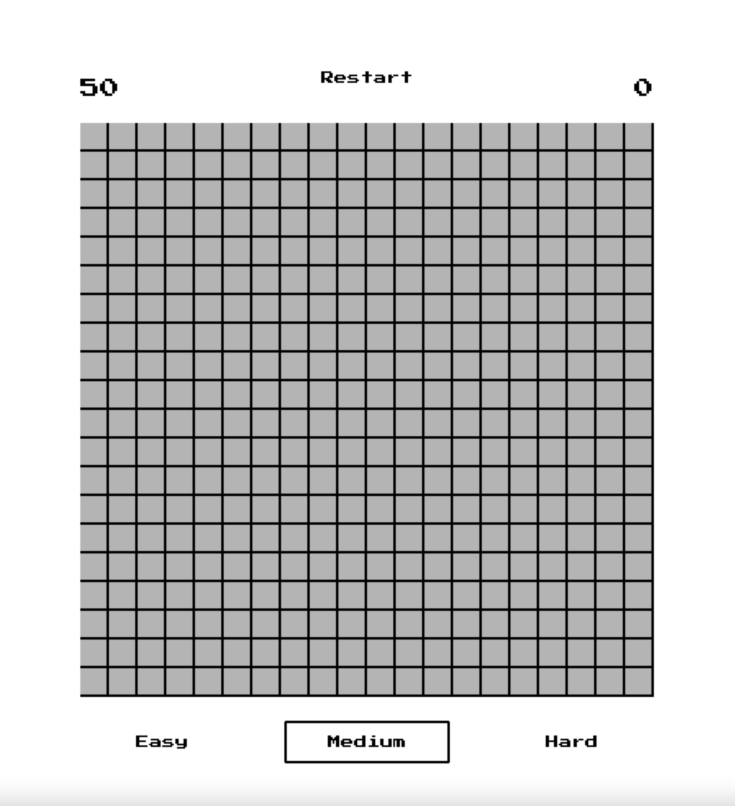
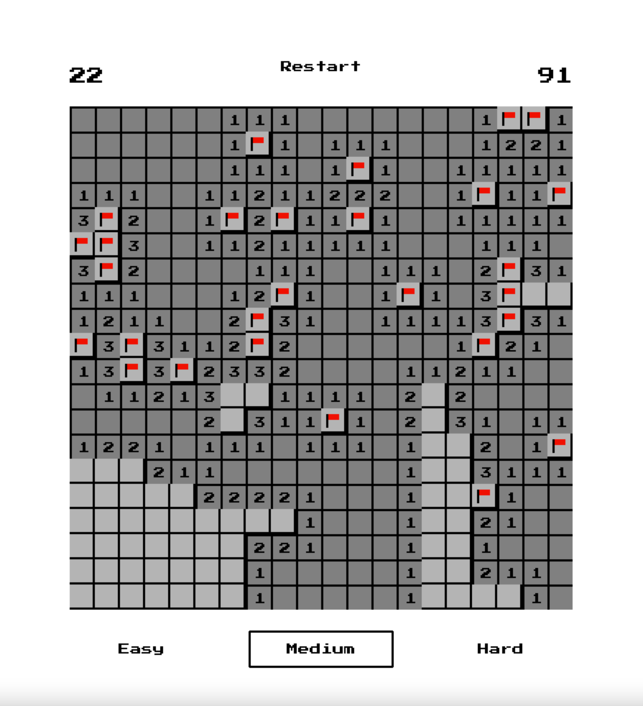

# :bomb: Minesweeper :triangular_flag_on_post:

### Project Description

This game is a recreation of minesweeper using Python and Pygame. It has all of the basic minesweeper functionalities such as uncovering and flagging, with three difficulties (easy, intermediate, and hard).

### Languages & Libraries Used

- [**Python:**](https://python.org) Primary language used for this project
- [**Pygame:**](https://pygame.org) Python module used to create the GUI

### Gameplay

This is what it looks like when you first open up the app. The default setting is medium difficulty, but you can always change that using the difficulty buttons on the bottom. Click on any cell on the board to begin the game. The two numbers at the top indicate the number of mines left (shown on the top left) and the time that has passed (shown on the top right). Use the restart button if you want to restart your game with the same difficulty.

Your goal is to uncover all of the cells that aren't mines.

### Mouse Controls

| Mouse action       | Action performed                                                    |
| --------------     | -------------                                                       |
| Left click         | Uncovers a cell                                                     |
| Right click        | Flags the cell                                                      |
| Left + right click | Indicates the uncovered adjacent cells or uncovers them accordingly |

### Credits

- *Press Start 2P* font from Google Fonts ([License](https://github.com/google/fonts/blob/master/ofl/pressstart2p/OFL.txt))
